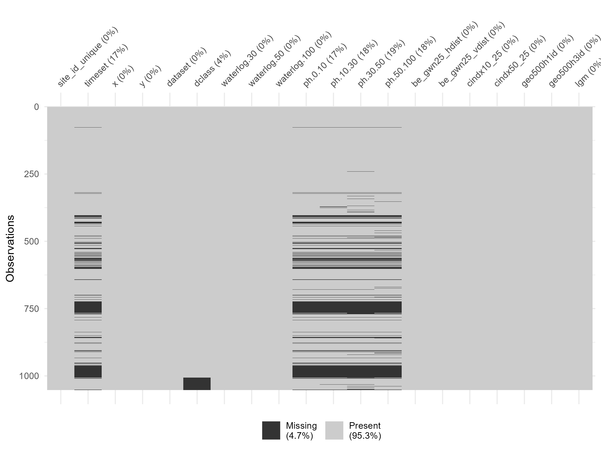
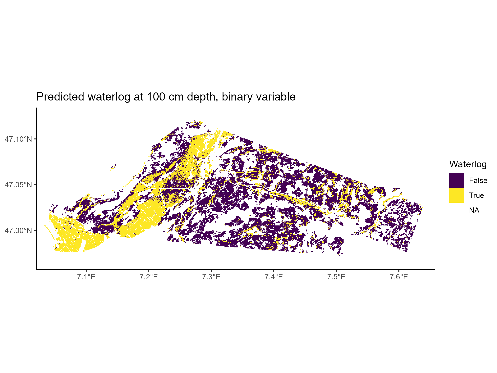
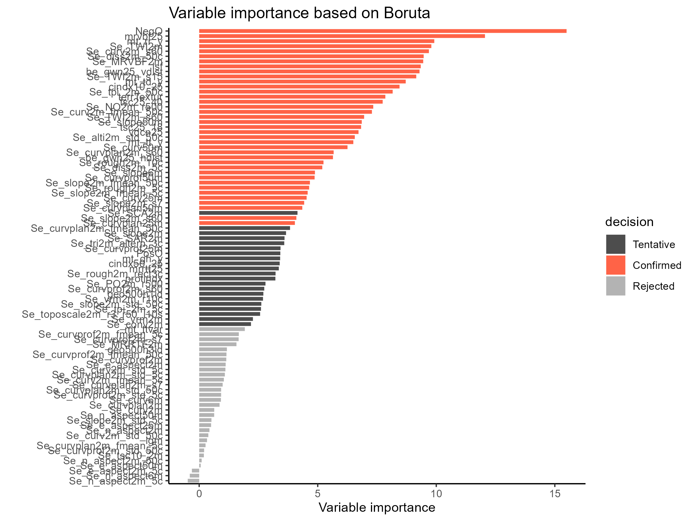
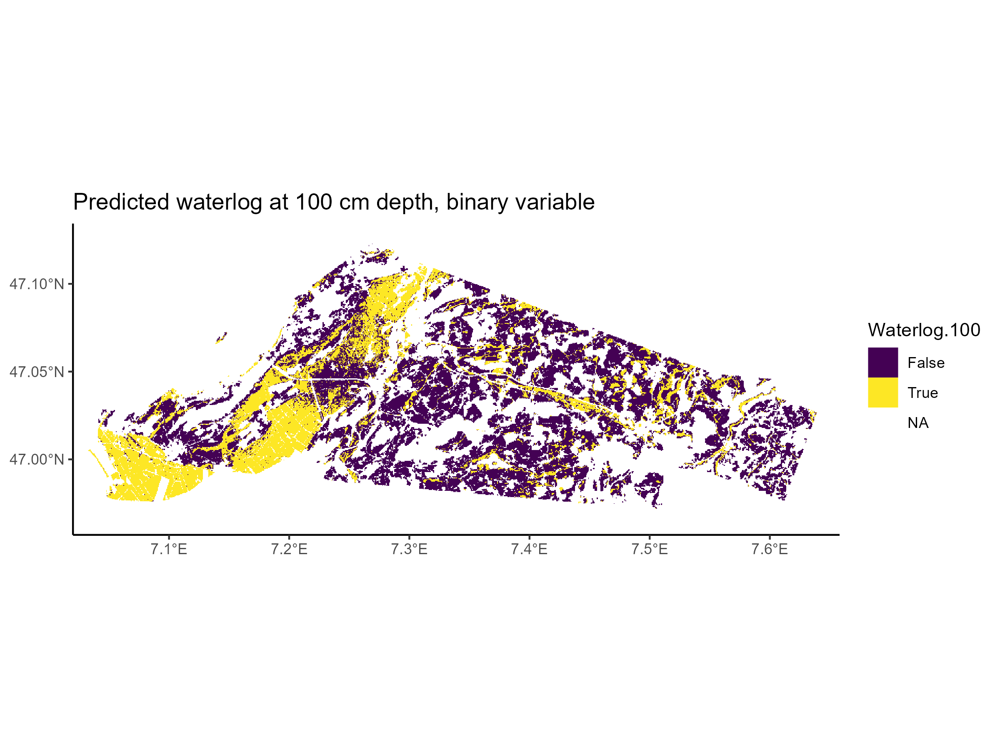
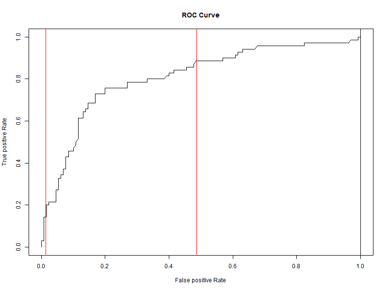

```{r setup, include=FALSE}
knitr::opts_chunk$set(echo = TRUE)
rm(list = ls())
```

# Note by Author

This markdown document represents a summary of the analysis done for this exersice. The key plots are shown, together with the interpretation of the results, together with some illustrative code chunks. For complete understanding of the code used, please refere to the respective "analys" files within the "analysis" folder. 


# 5.1 Simple Random Forest model

```{r}
source("../analysis/ex_soil/analys_data_setup.R")
```


Re-implement the digital soil mapping workflow, using Random Forest, as demonstrated in this tutorial, but for the binary categorical variable waterlog.100. Here are a few hints as a guide:

Make sure that the categorical target variable is encoded as a factor using the function factor().

Start with a model that includes all predictors, trained on the pre-defined training subset.

Evaluate the model on the testing subset of the data

Consider appropriate metrics as described in AGDS Book Chapter 8.3.

Is the data balanced in terms of observed TRUE and FALSE values?

What does this imply for the interpretation of the different metrics?

## 5.1.1 Exploratorive data analysis


### Data overview
```{r}
head(df_full)
```
### Factor encoding 

Check for variables with less than 10 discrete values, so we can code them to factors

```{r}
cat("Variables with less than 10 distinct values:", 
    ifelse(length(vars_categorical) == 0, "none", vars_categorical))

```


### Define Target variable and Predictors
```{r}
cat("The target is:", target,
    "\nThe predictors_all are:", paste0(predictors_all[1:8], sep = ", "), "...")
```
### Trainings and Test Data

Split the data into trainings and testing set. 
```{r}
cat("For model training, we have a calibration / validation split of: ",
    perc_cal, "/", perc_val, "%")
```
### Plot the distribution of NA's
```{r}
 

```

We see that our target variable "waterlog.100", doesn't have any missing values.


## 5.1.2 Train basic random forest

```{r}
source("../analysis/ex_soil/analys_basic_rf.R")
```
### Print Random Forest - Basic Forest

```{r}
print(rf_basic)
```

### Prediction Map - Basic Random Forest

```{r}


```


## 5.1.3 Classification Metrics - Basic Forest 

### Confusion Matrix - Basic Forest

```{r}
conf_matrix_basic
```

### Accuracy = (TP + TN )/ N - Basic Forest
```{r}
cat("the accuracy for the basic model is ",acc_basic)
```


### Precision = TP / (TP + FP) - Basic Forest
```{r}
cat("the precision for the basic model is ",prec_basic)
```

### f1 = 2TP / (2TP + FP + FN) - Basic Forest
```{r}
cat("the f1 for the basic model is ",f1_basic)

```

## 5.1.4 Balance of dataset and implications

Evaluate the model on the testing subset of the data. Consider appropriate metrics as described in AGDS Book Chapter 8.3. Is the data balanced in terms of observed TRUE and FALSE values? What does this imply for the interpretation of the different metrics?


Answer: 

The balance considers our target variable in this case "Water.log.100", which is
binary (0,1) encoded. We are interested to check if we have roughly as many ones as zeros in our data set, which would be desirable. 

The reason for this is that if, for example we would have mostly zeros, a simple algorithm (like one ignoring all covariates ) would always return a zero for new predictions.
Consequently in this scenario, an unbalanced dataset would result in a high share of false negatives (since all predictions would be zeros). Accordingly, an unbalanced dataset in the other direction, containing mostly ones, would result in a high share of false positives which is also not desirable. This is why we want our target variable to be balanced.

### balance estimation

Since we estimate our model only with the trainings set, this dataframe ist the important one in order to check for the balance.

```{r}
summary(df_train$waterlog.100 == 1)

```

```{r}
cat("the percentage of positives is equal to ", share_of_postives_train, "in the training dataset")
```


Consequently there is a reasonable chance to get an unrepresentative high number of false negatives in our predictions, which is relevant for the confusion matrices and the resulting diagnostic estimators. Namely the accurace = (TP + TN)/N could be underestimated by our models.


# 5.2 Variable selection (Boruta)

## 5.2.1 Reduction of Predictor Set

Reduce the predictor set as demonstrated in this tutorial.

### Variable importance basic model

```{r}
source("../analysis/ex_soil/analys_boruta_rf.R")
```

```{r}


```
## 5.2.2 Boruta Forest

### Print Random Forest - Boruta Forest
```{r}
print(rf_bor)
```
### Prediction map - Boruta Forest

```{r}


```

## 5.2.3 Classification Metrics - Boruta Forest

Repeat the model evaluation and compare the model performance on the test set with what was obtained with the model using all available covariates. Which model generalises better to unseen data?

Would the same model choice be made if we considered the OOB prediction error reported as part of the trained model object?

### Confusion matrix - Boruta Forest

```{r}
conf_matrix_bor
```

### Accuracy = (TP + TN )/ N - Boruta

```{r}
cat("the accuracy for the boruta model is ",acc_bor)
```


### Precision = TP / (TP + FP) - Boruta
```{r}
cat("the precision for the boruta model is ", prec_bor)
```

### f1 = 2TP / (2TP + FP + FN) - Boruta
```{r}

 cat("the f1 for the boruta model is ", f1_bor)

```

## 5.2.4 Model Comparison

### OOB Comparison

```{r}
cat("Looking at the prediction error, the Boruta Model would be preferred over the
basic case since its Prediction error with", sqrt(rf_bor$prediction.error), "smaller than the one of the basic model"
) 

```


### Comparison table for both models

```{r}
diag_table
```
In every diagnosis estimate, the boruta Forest performs higher than the Basic one,consequently we prefer this model over the other. 

This goes also for the prediction Error

### Check if the two prediction maps really are different

```{r}
summary(df_predict$prediction == df_predict_bor$prediction)
``` 
There are 24'164 data points where the boruta model returns another value compared to the basic model.


# 5.3. Model Optimization

In AGDS Book Chapter 11, you learned how to optimize hyperparameters using cross-validation.

## 5.3.1 Hyperparameter tuning 

Using the training data subset, implement a 5-fold cross-validation to optimise the hyperparameters mtry and min.node.size of the same Random Forest model as implemented above. You may use the {caret} library as demonstrated in AGDS Book.


```{r}
source("../analysis/ex_soil/analys_boruta_rf_tuned.R")
```


```{r}
## compare hyperparameters

cat("the optimal value vor mtry is", opt_mtry)
```


```{r}
 cat("the optimal value vor the minimal node size is", opt_min_node_size)

```

### comparison table for hyper parameters
```{r}
hyper.param.table
```
Comment: The optimal values vary quite strong when changing the random seed, so this shouldnt matter to much. This is also in line with the findings of Schratz et. al (2019), who pointed out that hyperparameter tuning has negligible effects for Random Forest models. 


## 5.3.2 Evaluation of tuned vs. untuned model.

Evaluate the optimized model on the test set using the same metrics as considered above. Does the model generalise better to unseen data than the initial model (which used default hyperparameters, see ?ranger::ranger).


### Train new ranger model with hyperparameters set to the optimal ones. 


### Print Random Forest - Boruta Tuned Forest

```{r}
# quick report and performance of trained model object
rf_bor_tuned

```

## 5.3.4 Classification Metrics - Boruta Tuned Forest

### Confusion Matrix - Boruta Tuned Forest

```{r}

# plot confusion matrix
conf_matrix_bor_tuned$table
```


### Accuracy = (TP + TN )/ - Boruta Tuned
```{r}
 cat("the accuracy for the tuned Boruta model is ",acc_bor_tuned)
```

### Precision = TP / (TP + FP) - Boruta Tuned

```{r}
 cat("the Precision for the tuned Boruta model is ",prec_bor_tuned)
```


### f1 = 2TP / (2TP + FP + FN)  - Boruta Tuned

```{r}
 cat("the F1 for the tuned Boruta model is ",f1_bor_tuned)
```


### OOB prediction error - Boruta Tuned
```{r}
 cat("the OOB for the tuned Boruta model is ",obb_bor_tuned)
```


### Comparison table for all models

```{r}
diag_table_3
```
Considering only the prediction error, the tuned Boruta model performs worse than the
untuned boruta model. Considering all other indicators, the tuned model performs better. 


# 5.4 Probabilistic predictions

## 5.4.1  Probabilistic Model

Using the optimised (or if you didn’t manage - the initial default) hyperparameters, train the Random Forest model, setting ranger::ranger(..., probability = TRUE).


This yields not a model predicting a binary class, but a probability of the target to be TRUE. This lets the user chose where to put the threshold for translating a probability to a binary class. E.g., if the predicted probability is > 0.5
, then consider this as a prediction of TRUE. 

### Build probabilistic model


```{r}
source("../analysis/ex_soil/analys_probability_rf.R")
```

```{r}
# re-train Random Forest model
rf_bor_prob
```

### Prepare vectors for AOC Curve
```{r}
head(conf_table)
```


### ROC - Curve

Establish the Reicever-operating-characteristic curve, as described in AGDS Book Chapter 8.3.

```{r}
 

```

## 5.4.2 Infrastructure Treshholds

Consider you inform an infrastructure construction project where waterlogged soils severely jeopardize the stability of the building. Then, consider you inform a project where waterlogged soils are unwanted, but not critical. In both cases, your prediction map of a binary classification is used as a basis and the binary classification is derived from the probabilistic prediction.


### How would you chose the threshold in each case?

For the first case, I would chose the highest treshhold where I still don't have any false negatives. 


```{r}
cat ("The highest treshhold without any false negatives would be ", max_treshold_0_FN)
```
This said, this is an extremely conservative choice. Alternatively, the treshhold could be chosen, after which increases in FP-rate are consistenly greater than the ones in the TP- Rate, which would be somewhere around 0.2


For the second case, I would chose a treshhold, which maximises an overall metric, e.g. the F1.

```{r}
cat ("The the treshhold returning the highest F1 would be ", max_treshold_F1, "with a a corresponding F1 of ",round(max(conf_table$f1),3) )
```

### Would you chose the same threshold in both cases? If not, explain why. 

Answer:

I would not chose the same treshhold in both cases because in the first example, false negatives are to be avoided as much as possible. This implies that there will be more buildings that we declare to be "unsave" even though they would be save (more false positives)

In the second example on the other hand, they are not that critical and we can try to strike a balance in minimizing both, false positives and false negatives. 


### Can you think of an analogy of a similarly-natured problem in another realm?

Answer : 

An analogy would be the testing of new drugs:

While testing a new drug for a serious disease, e.g. cancer, we want to minimize
Type I Errors, while Type II Errors are not very crucial. I.e. we only want to measure the effect of the drug given it exists (minimize false positives) and we accept,rejecting the use of the drug in some cases, event though it could help (we have more false negatives in return)

The other case would be the assessment of side effects of a new drug.

In that case we want to minimize false negatives, meaning we don't want any cases were we don't claim there are serious side-effect, even though they exist. At the same time we still don't want many false positives, meaning cases were we predict side effects to occur, even though that won't be the case. So, very similar to the infrastructure example, we would try to strike an overall balance between the two. 

References:  

Schratz, P., Muenchow, J., Iturritxa, E., Richter, J., & Brenning, A. (2019).
Hyperparameter tuning and performance assessment of statistical
and machine-learning
algorithms using spatial data. Ecological
Modelling, 406, 109–120.
