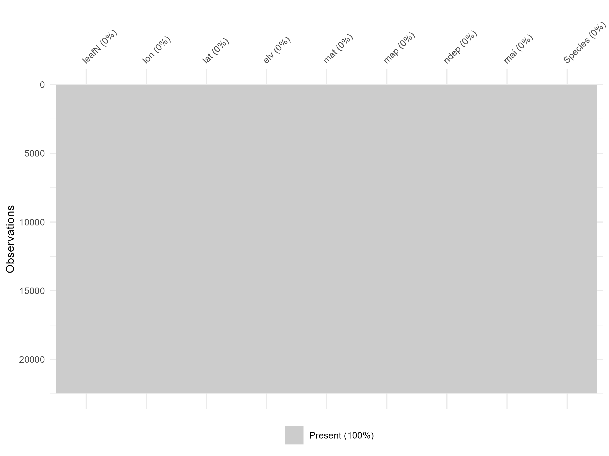
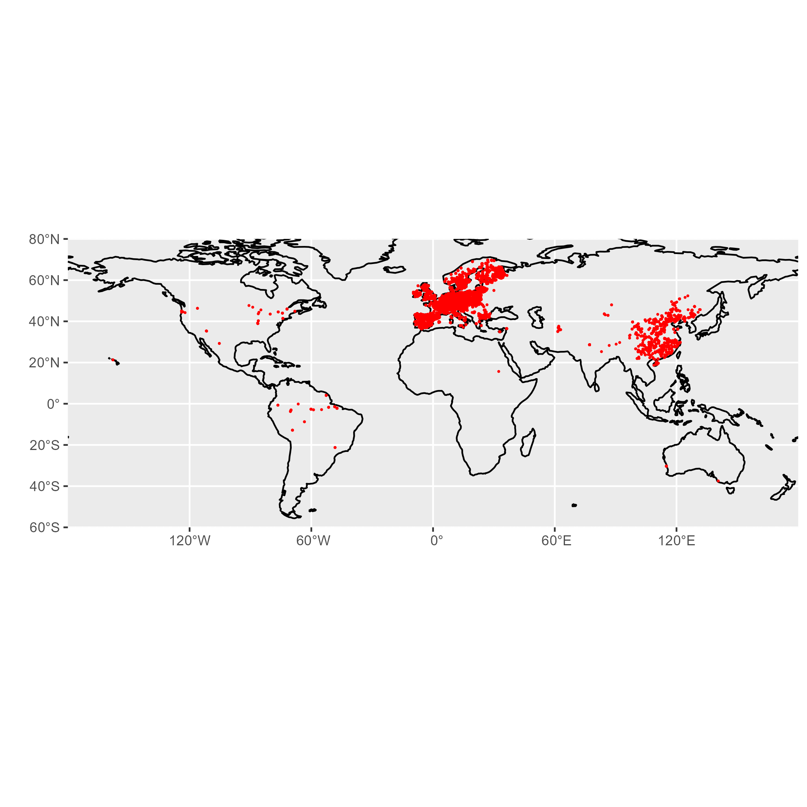
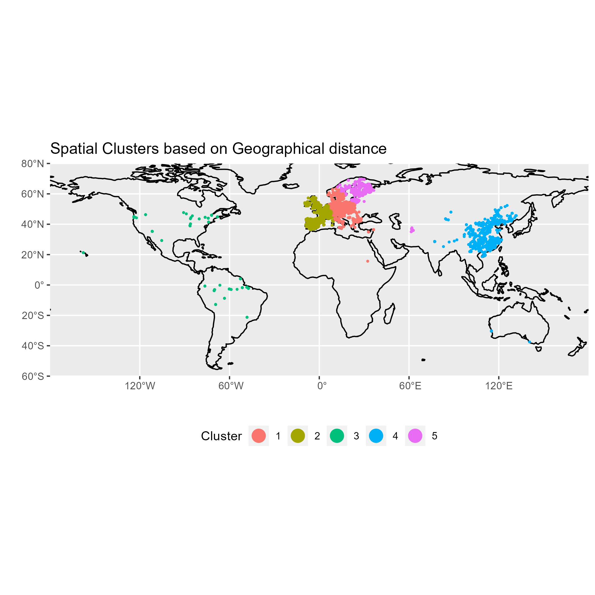
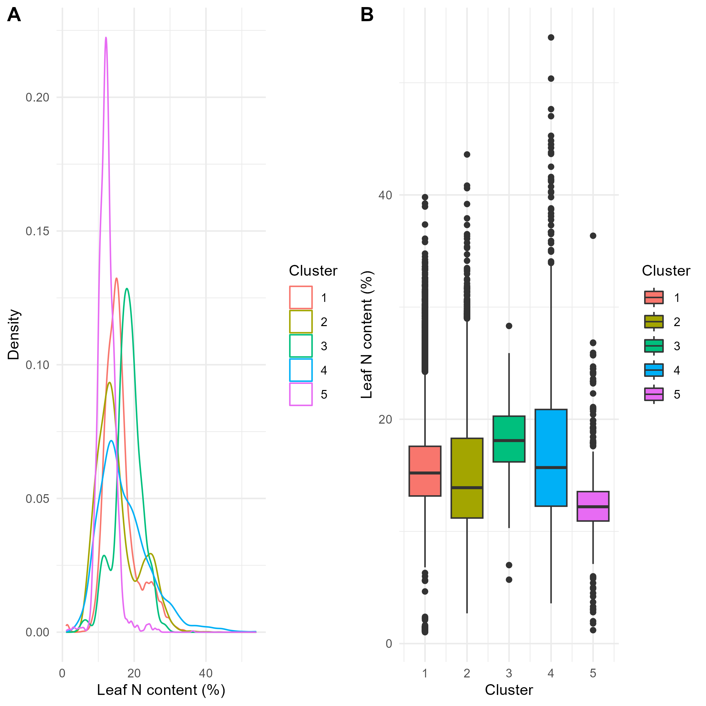
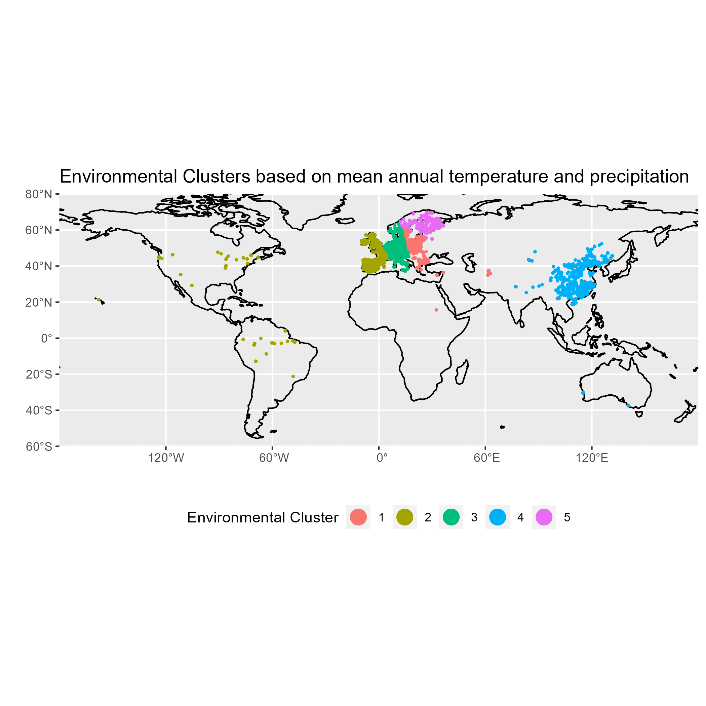
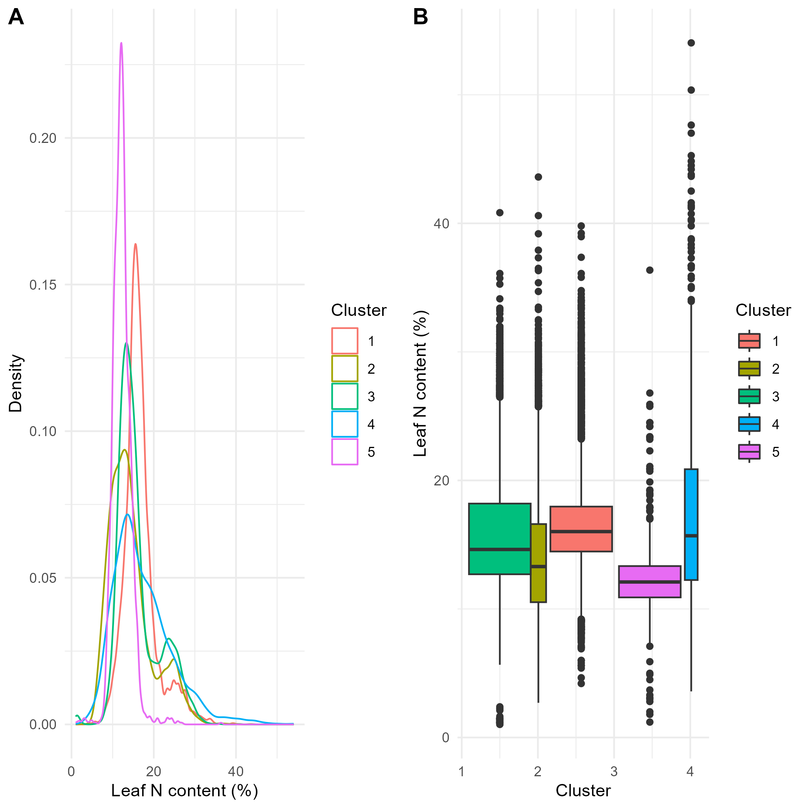
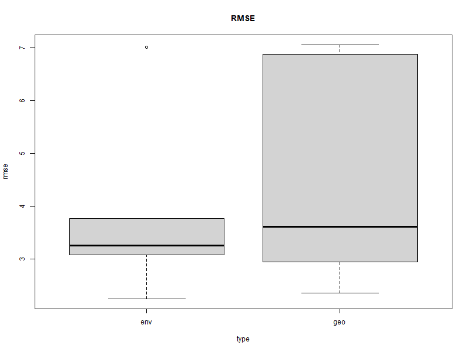
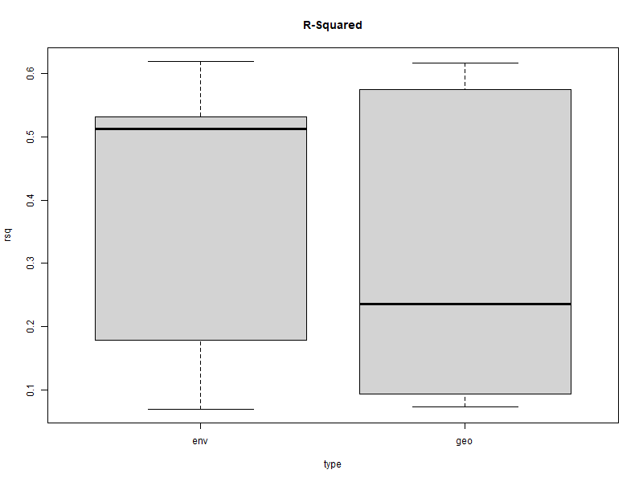

```{r setup, include=FALSE}
knitr::opts_chunk$set(echo = TRUE)
```

# Note by Author

This markdown document represents a summary of the analysis done for this exersice. The key plots are shown, together with the interpretation of the results, together with some illustrative code chunks. For complete understanding of the code used, please refere to the respective "analys" files within the "analysis" folder. 


# 2.1 Literature

Read the paper by Ludwig et al. (2023) and answer the following questions:


## 2.1.1 Random vs. Spatial CV

Explain the difference between a random cross-validation and a spatial cross-validation.

Answer:

Random CV divides the  Data randomly into k Folds, which then are subsequently used to train the model. For k times then, another of these folds is used as the validation data and the k-1 other folds as the Training data. After evaluating all of these models, the hyperparametres which maximise the respective metric can be picked. 

Random CV generates folds by picking random samples from the dataset at hand. If this data is representative of the actual prediction space, RC should return reasonable metrics. If this is not the case though, e.g. if there is strongly clustered data, random CV will reproduce this clustering within its folds. 

The main assumption in this context is the independence between different datapoints, which is normally not given for geographical data (i.e. Data Points near of each other tend to be more similar, which violates there statistical independence. )

Consequently it might be useful to generate folds not randomly, but divide the data based on a different, predefined criteria to reduce the clustering within the folds. Since there is in general much more environmental data available from the northern hemisphere than from all others, one straight forward idea would be to build folds based on geographic clusters and then do the CV. This is the basic idea of Spatial clustering. Of course, these distances don't have to be measured in geographical space, but can indicate any distance between any variable that might be relevant. 

By building folds which represent different clusters, all of them attribute equally to the performance metrics, calculated by the mean of all k Training rounds. Consequently, this would counteract the tendency of the resulting model to heavily represent the most prominent clusters. 


## 2.1.2 Alternatives to Geographical spatial CV

In spatial upscaling, we model the target based on environmental covariates. This implies that we assume the training data to sufficiently represent the conditions on which the model will be applied for generating predictions. Prediction errors may increase with an increasing distance of the prediction location from the training locations.

The paper by Ludwig et al. (2023) considers this “distance” as a geographical distance in Euclidean space. Do you see an alternative to measuring a distance that considers the task of spatial up scaling based on environmental covariates more directly?

Answer: 

One could still take the Euclidean space, not for geographical distance but the distances of the covariates themselves. Through this, the validity of the estimates, depending on different regions would be more directly linked to the covariate space represented in the training data. 

At the same time geographical distance doesn't seem like a very reasonable indicator, since an extreme high variation of environmental conditions might be encountered in very close geographic space (e.g. through variations in altitude or passing of natural barriers, such as waterbodies and mountain ranges). Consequently, the replacement of this metric by an other does seem reasonable. 

Another idea would be to generate folds based on predictor distance, but to give weights to each predictor, so that predictors with a higher feature performance also have higher relevance when generating the validation folds, but this would be outside the scope of this project.


# 2.2 Random Cross Validation

Use Random Forest to perform a 5-fold cross-validation with the leaf N data (leafN) and the following predictors:

elv: Elevation above sea level (m)
mat: mean annual temperature (degrees Celsius)
map: mean annual precipitation (mm yr
)
ndep: atmospheric nitrogen deposition g m
 yr
mai: mean annual daily irradiance µ
mol m
 s
Species: species name of the plant on which leaf N was measured
Report the mean RMSE and R
 across cross-validation folds. Chose hyperparameters as mtry = 3 and min.node.size = 12 and others as their default in ranger::ranger().

## 2.2.1 Data Preparation 

```{r}
source("../analysis/ex_upscale/analys_random_cv.R")
```
### Data Overview

First, we look at the dimensions of our Data set
```{r}
dim(dfs)
```
We seet that we have 22'472 Obersvations of 9 variables.


```{r}
head(dfs)
```
The data is as explained in the Exersice description, with the Leaf Nitrogen values, the coordinates, and different environmental features as columns. 


### Trainings and Test Data

We split the data into a 70% Trainings set and a 30% Testing set. 

```{r, echo = FALSE}
# Data splitting
split <- rsample::initial_split(dfs, prop = 0.7, strata = "Species")
df_train <- rsample::training(split)
```

```{r}
 

```
We see that there are no missing values at all. 


## 2.2.2 Random Forest Model


### Formulate model

Next, we formulate the model, in which we predict leave nitrogen values through a combination of different environmental factors. 


```{r}
# The same model formulation is in the previous chapter
pp <- recipes::recipe(leafN ~ elv + mat + map + ndep + mai + Species, 
                      data = df_train) |> 
  recipes::step_center(recipes::all_numeric(), -recipes::all_outcomes()) |>
  recipes::step_scale(recipes::all_numeric(), -recipes::all_outcomes())
```


### Print random Forest - Random CV

After training , we  print the results
```{r}
print(rf_1000_5)
```
### Metrics - Random CV

```{r}
# RMSE of 5-fold cross-validation
cat("the RMSE of the basic model is", round(rmse.bas, 3))

```

```{r}
# Rsquared of 5-fold cross-validation
cat("the R2 of the basic model is", r2.bas)

```


# 2.3 Spatial Crossvalidation
 

```{r}
source("../analysis/ex_upscale/analys_geographical_cv.R")
```


## 2.3.1 Map Discussion

Here is the distribution of our data across the globe.

```{r}

```


What do you observe? Discuss the potential implications of the geographical distribution of data points for spatial upscaling.

Answer:

The wast majoritiy of the datapoints are in Europe and Eastern parts of China. There are some datapoints in North - and South-America, one in northern Africa and some widely dispersed points in central Asia. Consequently, the northern Hemisphere is clearly over represented, especially European environment, alongside the eastern  regions of China. Thus, we would expect our model to show predict much better for environmental conditions which are similar to the ones of these regions. 


## 2.3.2 Build geographical Clusters

Perform a spatial cross-validation. 
To do so, first identify geographical clusters of the data using the k-means algorithm (an unsupervised machine learning method), considering the longitude and latitude of data points and setting . Plot points on a global map, showing the five clusters with distinct colors.
 
### Clusters based on geographical distance

We use the K-means algorithm in order to build different clusters using the following code. 

```{r}
# K-Means algorithm
clusters <- kmeans(
  dfs |> dplyr::select(lon, lat),
  centers = 5
)

#add to dataset
dfs <- cbind(dfs, clusters[["cluster"]]) |> rename(cluster = 10)

```

 
### Plot Geographical clusters

Plot points on a global map, showing the five clusters with distinct colors.

The regional clusters are shown on the following global map. 
```{r}

```


## 2.3.3 Plot the distribution of leaf N by regional cluster.

```{r, echo = FALSE}

```
Looking at the density and the boxplots based on geographical distance, we can see that the target variable doesn't change strongly dependent on the respective cluster.

If we compare it to the map, this is somewhat expected, since we can clearly see that very similar environmental conditions do lead to different clusters, as for example in central-northern Europe. 

## 2.3.4 Random Forest - Geographical Clusters

Split your data into five folds that correspond to the geographical clusters identified by in (2.).

fit a random forest model with the same hyperparameters as above and performing a 5-fold cross-validation with the clusters as folds.

Report the RMSE and the R-squared
 determined on each of the five folds

Note by Author: From here on out, I will refer to the clusters, which are built based on geographical distances between coordinates as the "geographical" clusters. The reason for this is, that in the last part, we will build clusters based on predictor space, which makes the use of the term "spatial clusters" possibly confusing. 

### Clusters into Folds

we use the following code create folds based on the clusters
```{r}
group_folds_train <- purrr::map(
  seq(length(unique(dfs$cluster))),
  ~ {
    dfs |> 
      select(cluster) |> 
      mutate(idx = 1:n()) |> 
      filter(cluster != .) |> 
      pull(idx)
  }
)

group_folds_test <- purrr::map(
  seq(length(unique(dfs$cluster))),
  ~ {
    dfs |> 
      select(cluster) |> 
      mutate(idx = 1:n()) |> 
      filter(cluster == .) |> 
      pull(idx)
  }
)

```

### Model Validation - Geographical CV

Then we train again the model and return the R-Squared together with the RMSE.

```{r}
# create a function that trains a random forest model on a given set of rows and 
# predicts on a disjunct set of rows
train_test_by_fold <- function(train_idx, val_idx) {
  
  # Train the model
  mod <- ranger(
    formula = leafN ~ elv + mat + map + ndep + mai + Species, 
    data = dfs[train_idx, ],
    mtry = 3,
    min.node.size = 12,
    num.trees = 500
  )

   # Predict on the validation set
  pred <- predict(mod, data = dfs[val_idx, ])
  
  # Calculate R-squared on the validation set
  rsq <- cor(pred$predictions, dfs$leafN[val_idx])^2
  
  # Calculate RMSE on the validation set
  rmse <- sqrt(mean((pred$predictions - dfs$leafN[val_idx])^2))
  
  return(tibble(rsq = rsq, rmse = rmse))
}
```


### Metrics - Geographical CV

Then we look specifically at the Metrics.

```{r}
print(output_geo)
```

```{r}
cat("the mean RMSE of the Geographical Cross Validation is", round(rmse.geo,3 ))
```

```{r}
cat("the mean R-Squared of the Geographical Cross Validation is",round(r2.geo,3) )

```


## 2.3.5 Comparison of Results - Geographical vs. Random CV

Compare the results of the spatial cross-validation to the results of the random cross-validation and discuss reasons for why you observe a difference in the cross-validation metrics (if you do).

```{r}
round(comp.table,3)
```
We see that the Random CV shows a clearly lower RMSE together with a higher R2.
This is expected, since the Random selection of the Validation folds reproduces the clustering of of the data itself. Consequently, while showing a relatively good fit to data coming from Western Europe and East China, the performance of the Random CV is probably overestimated, if we aim for a model which can be used on a global scale. 


# 2.4 Environmental cross-validation

The central rationale for spatial uspcaling is that we can model based on relationships between the target variable and the environment. The geographic location is not among the predictors. Thus, as long as the training data covers a wide enough range of environmental conditions, we can model for any new location where environmental conditions are within that range, irrespective of its geographical position. The challenge is just that the training data often doesn’t cover all environmental conditions of the globe, yet upscaling is often done for the globe.

Anyways, let’s probe the generalisability of a model not in geographical space, but in environmental space.


## 2.4.1 Model Validation - Environmental CV


```{r}
source("../analysis/ex_upscale/analys_environmental_cv.R")
```


To do so, perform a custom cross-validation as above, but this time considering five clusters of points not in geographical space, but in environmental space - spanned by the mean annual precipitation and the mean annual temperature. Report the R-squared and the RMSE on the validation set of each of the five folds.


### Standardize predictors 

in order to genereate distances in environmental space, we have to standardise our predictor set. 

```{r}
dfs_env <- dfs
dfs_env$map <- (dfs_env$map-mean(dfs_env$map) )/sd(dfs_env$map)
dfs_env$mat <- (dfs_env$mat-mean(dfs_env$mat) )/sd(dfs_env$mat)
```


### Clusters based on predictor distance

The method is analogous to the one used for geographical CV
```{r}
clusters_env <- kmeans(
  dfs_env |> dplyr::select(map, mat),
  centers = 5
)

dfs_env<- cbind(dfs_env, clusters_env[["cluster"]]) |> rename(cluster_env = 11)

```


### Plot environmental Clusters
```{r, echo = FALSE}

```


###  Plot the distribution of leaf N by environmental cluster.

```{r, echo = FALSE}

```

We can see looking at the densities and tha boxplots that the Leave Nitrogen values don't differ widely between the different environmental clusters, which is similar to the boxplots of the clusters based on geographical distance. This comes unexpected, since we would think that the different clusters lead to different levels of leaf nitrogen. Consequently, this might indicate a relatively low feature importance of annual temperature and precipitation for leaf nitrogen values. 

### Model Validation - Environmental CV

The Training of the Random Forest for environmental clustering is analogous to the code used for the geographical clusters. 


### Results - Environmental Clustering


```{r, echo = FALSE}
output_env
```


```{r}
cat("the RMSE of the environmental Cross Validation is", rmse.env)
```

```{r}
cat("the R-Squared of the environmental Cross Validation is", mean(output_env$rsq))

```


## 2.5.2 Comparison of Results - All three models

Compare the results of the environmental cross-validation to the results of the random and the spatial cross-validation and discuss reasons for why you observe a difference in the cross-validation metrics (if you do).

### Metrics Table

```{r}
metrics.table
```

### comparison of the two spatial models

In the last step, we compare the different RMSE's and R2 of the different validation rounds by both models. 

```{r}

```


```{r}


```
As we can see, both metrics are very similarly distributet across both models, considering that we have only 5 data points (see discussion for further explanation)

### Discussion

Looking at the RMSE and the R-Squared , the Model done through random shows the smallest standard error and the higher R-Squared, followed by the Environmental CV and the Spatial CV, which shows the highest error and the smallest R-Squared. 
This said, both Metrics of the latter two models are fairly close to each other. 

This result is expected. Since the data itself is clustered, random CV reproduces this clustering within its folds, which means that the resulting model should show a relatively good fit to such clustered data.

We intentionally corrected for this clustering through the generation of folds based on distance in geographic and predictor space for the other two models, so their fit, to the clustered data is worse , but they should be more useful in predicting for unknown data all over the globe, than the first model. One could also say that the RMSE for the Random CV is underestimated, due to the clustering of the data. 

The mild difference between the RMSE of the environmental and the spatial CV on the other hand, is somewhat surprising. Since we expect predictors in our model to have a significant importance, the idea is that generating the CV Folds based on predictor space, should correct the clustering of the sampling data even more than the folds based geographical distance. Consequently, we would expect the RMSE of the Environmental CV to be higher than the one of the geographical CV. However the opposite is the case in the data and the difference also persists when changing the random seed. 

Looking at the box plots of RMSE and R-squared, we can see that both metrics are very similar distributed for the geographical and the environmental clustering, considering that we have only 5 Data points for each CV. Hence, both models seem to be similar in their extrapolating power, if the interest is to find a model which can be used on a global scale.

Still, I would argue that the clusters based on predictor distance, and hence the model, is more desirable, if we want to interpret the results and formulate Hypothesizes out of it. This is because we can formulate hypothesises about the nature of the relationship between our target and the predictors. If we only use geographical distance on the other hand, this will be hard. 

One possible explanation would be that the predictors chosen, annal mean temperature and precipitation don't have a high enough feature importance. This could definitely be for two reasons: 

First, Vegetation growth is not only dependent on annual means of these variables , but also of the variation between seasons, months and days of them. Consequently, the yearly averages might not have much explaining power. 

Secondly, there are other variables in the model, like atmospheric nitrogen content, or Solar iradiance that may have a much higher predicting power in general. This could be checked in a further step. If this were to be true, one could try to generate the folds based on the predictor distance of all predictors. But even then, we calculate the clusters based on the euclidean distance, which means that the folds will not correspond to the feature importance of the predictors. So this approach would need further consideration.
